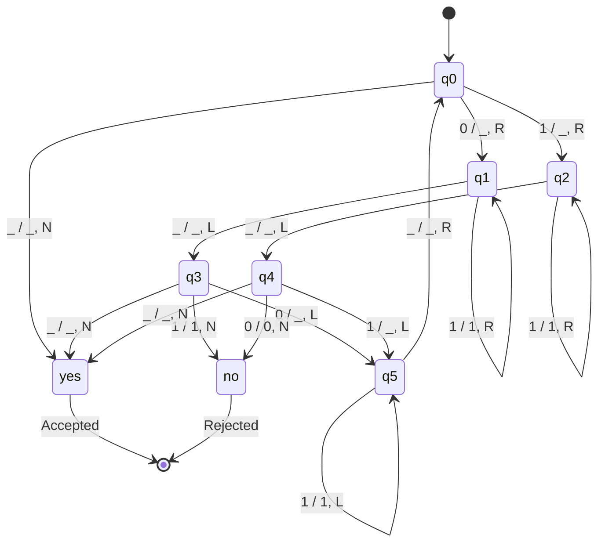

So I have been dying to write this blog post for a while, I feel great that I had some time to focus on this topic. Initially my primary reason to write this post is
I see great negligence from very senior developers when they hear "SQL" and I came across a few very senior interviewers who said "SQL is not even programming language, we use ORMs, why bother learning something that is not even a programming language (they mean SQL)" so the main purpose of this post is to shed some light over ignorance/incompetence with the proof of "SQL indeed is a programming language" and why you must learn and practice it just like other programming languages.

First of all, we need to talk about what makes a language a programming language. It is actually very simple, "Turing completeness" is what makes a language a programming language. But what is "Turing completeness"? I am glad you asked, short answer is you need to understand "Turing machines" before we talk about "Turing completeness". What is a "Turing machine"?

Turing machine is a theoretical device that was invented by Alan Turing (check on your £50 bank note bills, he is right there!) in order to understand computation. Turing machine has:
- Long tape divided into cells (think as an infinite long strip of paper)
- A head that can read symbols from long tape then write new symbols then move left/right or stand still
- The machine state (think possible "modes" that machine can be in)
- The transition rules (a set of rules that dictate the flow of current state to new states)

Now, back to "Turing completeness", a system is Turing complete if it can simulate any Turing machine. This means it can solve any problem that a Turing machine can solve.

So if I write how to solve a niche problem with Turing machine simulation in SQL, I will prove that "SQL is indeed a programming language". Notice the word that we are saying "simulation" because a real Turing machine has infinite memory and CPU that never halts, it is a theoretical device which can be implemented in any real programming languages.

## Turing Machine Simulation in SQL

First of all, we are going to need our machine. And machine needs to have initial state, accept state, reject state, blank symbol and max steps to halt. Accept state means a positive outcome that leads to halt. Reject state means a negative outcome that leads to halt. The word symbol means what symbol is located at the each cell of the tape.

```sql
CREATE TABLE machine (
    initial_state VARCHAR(64) NOT NULL,
    accept_state VARCHAR(64) NOT NULL,
    reject_state VARCHAR(64) NOT NULL,
    blank_symbol VARCHAR(1) NOT NULL DEFAULT '_',
    max_steps INTEGER NOT NULL DEFAULT 1000
);
```

Secondly we need to know transition rules which is the state diagram for any sort of Turing machine. Before we switch from state to new_state, we must read from the tape (read_symbol), we must write to the tape (write_symbol) then finally we can act on the direction whether it is left/right or none.

```sql
CREATE TABLE transition_rules (
    state VARCHAR(64) NOT NULL,
    new_state VARCHAR(64) NOT NULL,
    read_symbol VARCHAR(1) NOT NULL,
    write_symbol VARCHAR(1) NOT NULL,
    move_direction VARCHAR(1) NOT NULL CHECK (move_direction IN ('L', 'R', 'N'))
);
```

Before we go any further, I will add procedures for machine and transition rules so that in a capsulated procedure (program) which will contain different transition rules for 1 machine, we can use them easily. Machine is always a singleton which needs to be cleaned everytime it is set, Transition rules need to be only cleaned in a capsulated procedure (program).

```sql
-- initialize_machine initializes the Turing machine for a specific program
CREATE OR REPLACE PROCEDURE initialize_machine(
    initial_state VARCHAR(64),
    accept_state VARCHAR(64),
    reject_state VARCHAR(64),
    blank_symbol VARCHAR(1) DEFAULT '_',
    max_steps INTEGER DEFAULT 1000
) AS $$
BEGIN
    DELETE FROM machine; -- clear
    
    INSERT INTO machine VALUES (initial_state, accept_state, reject_state, blank_symbol, max_steps);
END;
$$ LANGUAGE plpgsql;

-- add_transition_rule adds transition rule for a specific program
CREATE OR REPLACE PROCEDURE add_transition_rule(
    state VARCHAR(64),
    new_state VARCHAR(64),
    read_symbol VARCHAR(1),
    write_symbol VARCHAR(1),
    move_direction VARCHAR(1)
) AS $$
BEGIN
    INSERT INTO transition_rules VALUES (state, new_state, read_symbol, write_symbol, move_direction);
END;
$$ LANGUAGE plpgsql;
```

In Turing machines, the standard convention is that the head reads the current symbol, then writes a new symbol, and finally moves. This is known as the "read-write-move" sequence for each step of the computation.

Now we will define a function for running steps(iterations) that follows "read-write-move" algorithm. To help you understand the arguments and return parameters, I'll explain the logic flow.

- Take current state, accept state and reject state
- If current state is accept state or reject state, we return current state and halt
- Take the tape (it is long text), take the position of the tape
- We use pos to determine if we are inside of the tape, we take read the symbol from the tape. If outside of tape, we read the symbol as blank so we need to know what blank symbol is. Remember string indices start from 1 in SQL
- Query existing transition rule that matches our current state and read symbol from tape
- If transition rule is not found, return halted as true
- Write the new symbol, which is indicated in the transition rule, to the tape
- Increment or decrement the position according to move direction (which is also indicated in the transition rule)
- Finally, return new state, the modified tape, the new position and the halted status

The reason why we use a function over procedure is an obvious one, we need to return halted status and other return parameters since they will be used in a loop to determine the halting point.

```sql
-- run_step executes a single step of machine
CREATE OR REPLACE FUNCTION run_step(
    current_state VARCHAR(64),
    accept_state VARCHAR(64),
    reject_state VARCHAR(64),
    tape TEXT,
    pos INTEGER,
    blank VARCHAR(1)
) RETURNS TABLE (
    new_state VARCHAR(64),
    new_tape TEXT,
    new_pos INTEGER,
    halted BOOLEAN
) AS $$
DECLARE
    tape_length INTEGER;
    symbol VARCHAR(1);
    rule RECORD;
BEGIN
    -- check if it is a final state
    IF current_state = accept_state OR current_state = reject_state THEN
        RETURN QUERY SELECT current_state, tape, pos, TRUE;
        RETURN;
    END IF;

    tape_length := length(tape);

    -- get the current symbol
    IF pos < 1 OR pos > tape_length THEN
        symbol := blank;
    ELSE
        symbol := substr(tape, pos, 1);
    END IF;
    
    -- query transition rule
    SELECT * INTO rule FROM transition_rules tr
    WHERE tr.state = current_state AND tr.read_symbol = symbol
    LIMIT 1;
    
    IF rule IS NULL THEN -- no rule found, halt
        RETURN QUERY SELECT current_state, tape, pos, TRUE;
        RETURN;
    END IF;
 
    IF pos < 1 THEN -- extend tape left
        tape := rule.write_symbol || tape;
        pos := 1;
    ELSIF pos > tape_length THEN -- extend tape right
        tape := tape || rule.write_symbol;
    ELSE
        tape := substr(tape, 1, pos-1) || rule.write_symbol || substr(tape, pos+1);
    END IF;
    
    IF rule.move_direction = 'L' THEN
        pos := pos - 1;
    ELSIF rule.move_direction = 'R' THEN
        pos := pos + 1;
    END IF;
    
    RETURN QUERY SELECT rule.new_state, tape, pos, FALSE;
END;
$$ LANGUAGE plpgsql;
```

And now we are going to be define our event loop, it will be a procedure since it doesn't need to return anything, however I will need to debug or show outputs to my fellow readers at some point so I will define a new machine steps table to record every step of my machine for debugging purposes.

```sql
CREATE TABLE machine_steps (
    step INTEGER NOT NULL,
    state VARCHAR(64) NOT NULL,
    tape TEXT NOT NULL,
    position INTEGER NOT NULL,
    halted BOOLEAN NOT NULL DEFAULT FALSE
);
```

Our algorithm for running machine is relatively simple.

- Take tape which is a text as argument
- Assign initial state, accept state, reject state, blank symbol and max steps from machine
- Record the first machine step as 0
- While it is not halted and step is less than max steps, start the loop
- In the loop, increment the step, execute one machine step and assign new state, new tape, new position and halted status
- In the loop, record the machine step byproducts
- After loop ends, if steps has reached max steps and not halted, set last machine step with timeout state and halted status as halted

> Fun fact, max steps is defined in our program to overcome the most famous theoritical problem in computer science (aka Halting problem). The Halting Problem asks whether there exists a general algorithm that can determine, for any arbitrary program and input, whether that program will eventually halt or run forever. Turing proved that no such algorithm can exist - it's mathematically impossible to create a procedure that can always correctly predict whether an arbitrary program will halt.

```sql
-- run_machine runs machine
CREATE OR REPLACE PROCEDURE run_machine(t TEXT) AS $$
DECLARE
    tape TEXT := COALESCE(t, '');
    state VARCHAR(64);
    position INTEGER := 1;
    accept_state VARCHAR(64);
    reject_state VARCHAR(64);
    blank_symbol VARCHAR(1);
    max_steps INTEGER;
    halted BOOLEAN := FALSE;
    step INTEGER := 0;
BEGIN
    DELETE FROM machine_steps; -- clear
    
    -- read machine state
    SELECT m.initial_state, m.accept_state, m.reject_state, m.blank_symbol, m.max_steps
    INTO state, accept_state, reject_state, blank_symbol, max_steps
    FROM machine m;
    
    -- record machine step
    INSERT INTO machine_steps (step, state, tape, position, halted)
    VALUES (step, state, tape, position, halted);
    
    WHILE NOT halted AND step < max_steps LOOP
        step := step + 1;
        
        -- execute one machine step and directly assign results to main variables
        SELECT fn.new_state, fn.new_tape, fn.new_pos, fn.halted
        INTO state, tape, position, halted
        FROM run_step(state,  accept_state, reject_state, tape, position, blank_symbol) fn;
        
        -- record one machine step
        INSERT INTO machine_steps (step, state, tape, position, halted)
        VALUES (step, state, tape, position, halted);
    END LOOP;
    
    -- check if we timed out
    IF step = max_steps AND NOT halted THEN
        UPDATE machine_steps SET state = 'TIMEOUT', halted = TRUE
        WHERE step = max_steps;
    END IF;
END;
$$ LANGUAGE plpgsql;
```

With this our Turing Machine is complete!!! now how do we actually run it? well, you sort of need a state diagram that solves a problem! In the end, if you don't have a problem, why do you need a machine at the first place?

I have come up with a palindrome recognizer state diagram below, let me explain briefly. It looks a bit complicated at the beginning but when you do the napkin calculation on a given basic input, it makes so much sense.




Since we have our transition rules (state diagram above), we can write our procedure. Below is the palindrome program in SQL procedure which uses Turing machine to solve the palindrome problem.

```sql
-- run_palindrome_program runs the palindrome program in Turing machine
CREATE OR REPLACE PROCEDURE run_palindrome_program(t TEXT) AS $$
BEGIN
    DELETE FROM transition_rules; -- clear
    
    CALL initialize_machine('q0', 'yes', 'no');
    
    -- q0: read left most symbol and move right side
    CALL add_transition_rule('q0', 'q1', '0', '_', 'R'); 
    CALL add_transition_rule('q0', 'q2', '1', '_', 'R'); 
    CALL add_transition_rule('q0', 'yes', '_', '_', 'N'); 
    -- q1: 0 was at the beginning, now go to the right-most end
    CALL add_transition_rule('q1', 'q1', '0', '0', 'R'); 
    CALL add_transition_rule('q1', 'q1', '1', '1', 'R'); 
    CALL add_transition_rule('q1', 'q3', '_', '_', 'L'); 
    -- q2: 1 was at the beginning, now go to the right-most end
    CALL add_transition_rule('q2', 'q2', '0', '0', 'R'); 
    CALL add_transition_rule('q2', 'q2', '1', '1', 'R'); 
    CALL add_transition_rule('q2', 'q4', '_', '_', 'L');
    -- q3: check if last symbol matches for 0 at the beginning
    CALL add_transition_rule('q3', 'q5', '0', '_', 'L'); 
    CALL add_transition_rule('q3', 'no', '1', '1', 'N'); 
    CALL add_transition_rule('q3', 'yes', '_', '_', 'N'); 
    -- q4: check if last symbol matches for 1 at the beginning
    CALL add_transition_rule('q4', 'q5', '1', '_', 'L'); 
    CALL add_transition_rule('q4', 'no', '0', '0', 'N'); 
    CALL add_transition_rule('q4', 'yes', '_', '_', 'N'); 
    -- q5: now go back to the left-most end
    CALL add_transition_rule('q5', 'q5', '0', '0', 'L'); 
    CALL add_transition_rule('q5', 'q5', '1', '1', 'L'); 
    CALL add_transition_rule('q5', 'q0', '_', '_', 'R'); 
    
    CALL run_machine(t);
END;
$$ LANGUAGE plpgsql;
```

Walking through the example with the string "101":

At yes state - The machine halts and accepts the string.

```shell
turing_machine=# call run_palindrome_program('101');
CALL
turing_machine=# select * FROM machine_steps;
 step | state | tape | position | halted 
------+-------+------+----------+--------
    0 | q0    | 101  |        1 | f
    1 | q2    | _01  |        2 | f
    2 | q2    | _01  |        3 | f
    3 | q2    | _01  |        4 | f
    4 | q4    | _01_ |        3 | f
    5 | q5    | _0__ |        2 | f
    6 | q5    | _0__ |        1 | f
    7 | q0    | _0__ |        2 | f
    8 | q1    | ____ |        3 | f
    9 | q3    | ____ |        2 | f
   10 | yes   | ____ |        2 | f
   11 | yes   | ____ |        2 | t
(12 rows)
```

If you want do try on your own, you can clone my repository. Let's try `1001` for example.
```
git clone https://github.com/mrwormhole/turing-machine-in-sql
docker compose up -d --build
docker exec -it postgres-turing psql -U turing -d turing_machine
turing_machine=# select * FROM machine_steps;
turing_machine=# call run_palindrome_program('1001');
turing_machine=# select * FROM machine_steps;
```

```
------+-------+-------+----------+--------
    0 | q0    | 1001  |        1 | f
    1 | q2    | _001  |        2 | f
    2 | q2    | _001  |        3 | f
    3 | q2    | _001  |        4 | f
    4 | q2    | _001  |        5 | f
    5 | q4    | _001_ |        4 | f
    6 | q5    | _00__ |        3 | f
    7 | q5    | _00__ |        2 | f
    8 | q5    | _00__ |        1 | f
    9 | q0    | _00__ |        2 | f
   10 | q1    | __0__ |        3 | f
   11 | q1    | __0__ |        4 | f
   12 | q3    | __0__ |        3 | f
   13 | q5    | _____ |        2 | f
   14 | q0    | _____ |        3 | f
   15 | yes   | _____ |        3 | f
   16 | yes   | _____ |        3 | t
```

You may think that it is not efficient at all, but I want to remind you that this was the fundamental to the whole computing paradigm. We are not focusing so much on efficiency here since everything is tied to a single while tight loop like in videogames. What matters here is if you can replicate the algorithm and write it in a claimed language. It means that claimed language is indeed a programming language.

## Final Words

I want to stress a final point. We have utilized "pl/pgsql" which is the procedural language of PostgreSQL. During ANSI-SQL (SQL-86/SQL-89), SQL was not turing complete at that time because it lacked recursive structures such as loops. SQL-99 added "WITH RECURSIVE" to do while loops and procedural elements (WHEN/CASE etc). In today's world, every production database is minimum SQL-99 compliant which makes them a valid programming language. For example, even sqlite's SQL dialect is turing complete.

Lastly, even if we lived before 1999 and no SQL-99 existed, entire world's data would be running on SQL since 1986. Why would people take pride of learning ORM abstractions rather than learning fundamentals of existing databases. And ORM abstractions will surely change more often and not provide the full feature sets of what you can achieve. It is just wishful thinking to ignore SQL and treat it as a chore rather than a powerful tool.
